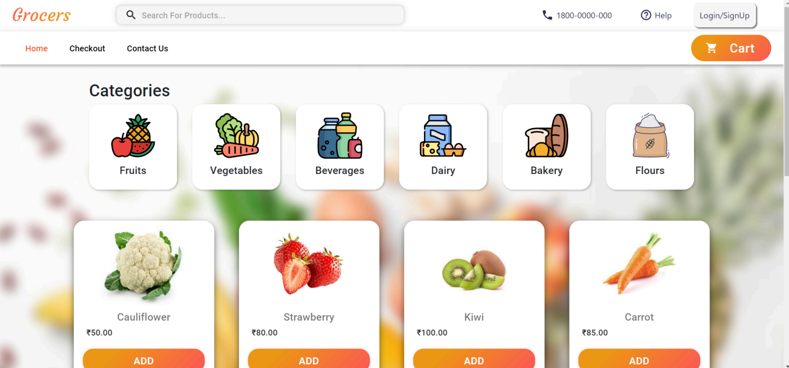
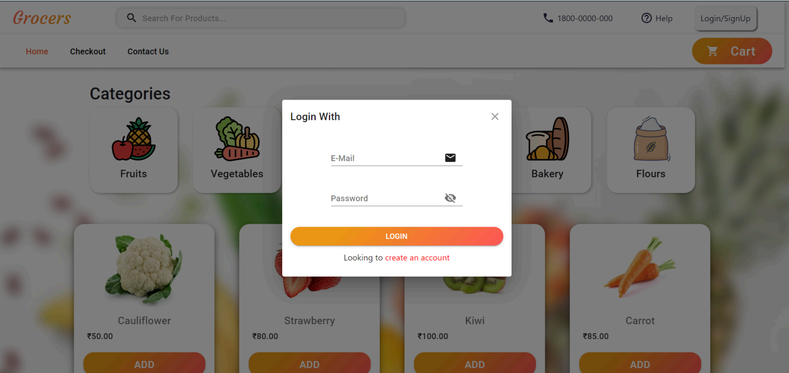
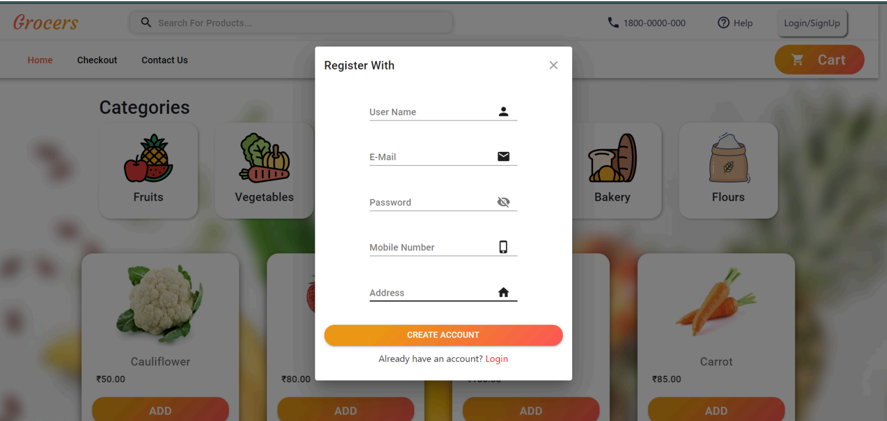
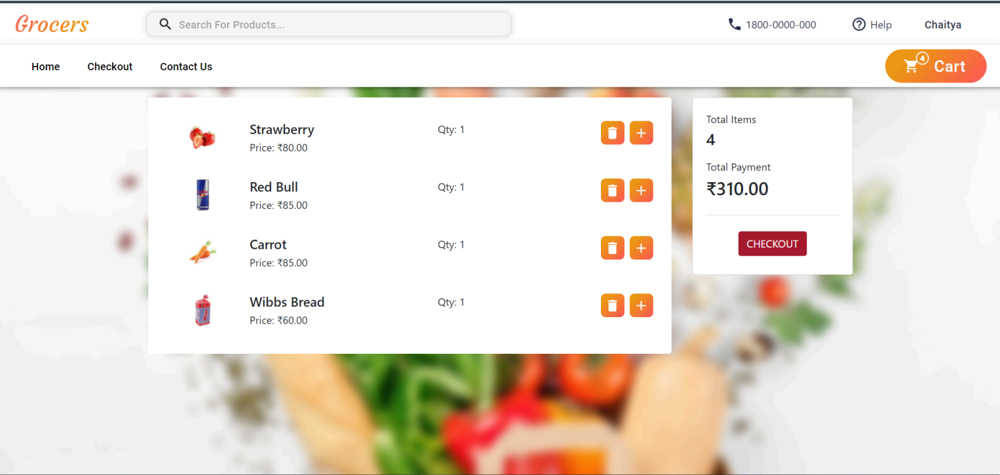
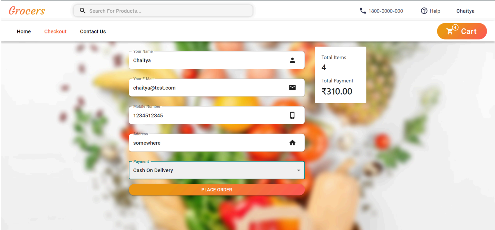
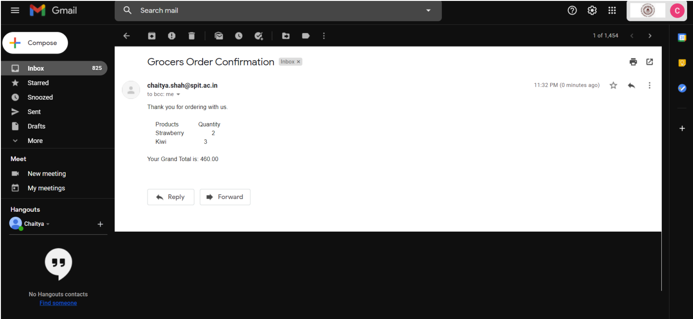
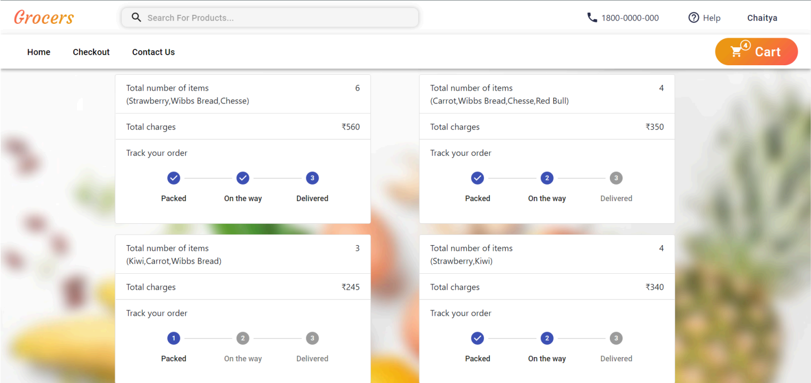
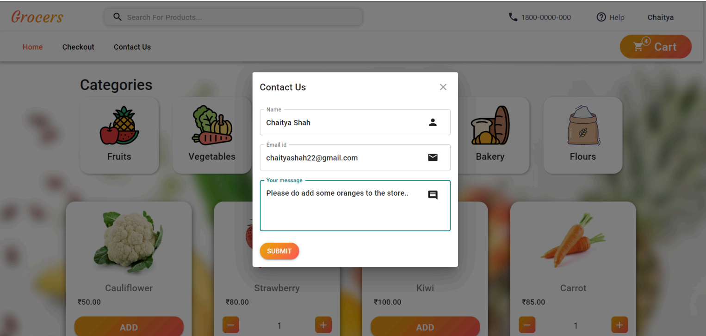
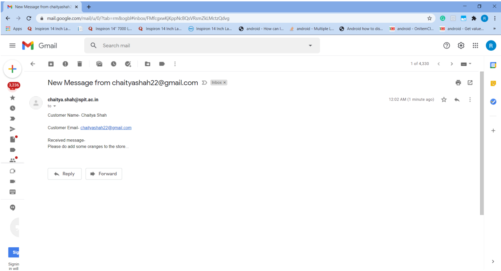

# Grocery Shopping Website

## Introduction

This project is a full-stack web application designed to provide a seamless and contactless grocery shopping experience. It allows users to browse through available products, add them to a virtual shopping cart, and place orders online. This system is particularly relevant in scenarios requiring minimal social contact, ensuring customers can receive their groceries without leaving their homes.

## Features

- **User Registration and Login:** New users can register, and existing users can log in to access the shopping functionalities.
- **Inventory Management:** Admins can manage product listings, including adding new items, deleting, and updating existing ones.
- **Order Placement:** Users can view products, add them to their cart, and place orders.
- **Payment and Order Confirmation:** Supports Cash on Delivery and Internet Banking. Users receive an email confirmation once the order is successfully placed.
- **Contact Us:** Users can send messages and queries through a form, which are received via email by the administrator.

## Technology Stack

<ul>
  <li><strong>Frontend:</strong> ReactJS </li>
  <li><strong>Backend:</strong> Django </li>
</ul>

## Screenshots

Below are the screenshots depicting the key functionalities and pages of the application:

1. **Homepage:** Showcases all available products and categories for easy navigation.
   
   

2. **Login Form:** Allows returning customers to log into their accounts.
   
   

3. **Registration Form:** New users can create accounts using this form.
   
   

4. **Cart Summary:** Displays the details of items added to the shopping cart.
   
   

5. **Checkout Form:** For completing payment procedures and placing orders, including options for Cash on Delivery and Card Payment.
   
   

6. **Order Confirmation Email:** A sample email confirming the successful placement of an order.
   
   

7. **Order Summary:** Lists all orders placed by the customer.
   
   

8. **Contact Us Form:** For sending queries and messages to the store's administrator.
   
   

9. **Administrator's Email:** Shows how messages from the "Contact Us" form are received by the admin.
   
   

## Getting Started

To get a local copy up & running follow these simple steps.

### Prerequisites

- npm
  ```sh
  npm install npm@latest -g
  ```
- Python 3.8 or later

### Installation

1. Clone the repo
   ```sh
   git clone https://github.com/shashank-patel007/Grocery-Delivery-System.git
   ```
2. Install NPM packages for the frontend
   ```sh
   cd frontend
   npm install
   ```
3. Install Python dependencies for the backend
   ```sh
   cd backend
   pip install -r requirements.txt
   ```

### Running the application

1. Start the backend server
   ```sh
   python manage.py runserver
   ```
2. Run the frontend application
   ```sh
   cd frontend
   npm start
   ```

## Contributing

Contributions are what make the open-source community such an amazing place to learn, inspire, and create. Any contributions you make are **greatly appreciated**.

1. Fork the Project
2. Create your Feature Branch (`git checkout -b feature/AmazingFeature`)
3. Commit your Changes (`git commit -m 'Add some AmazingFeature'`)
4. Push to the Branch (`git push origin feature/AmazingFeature`)
5. Open a Pull Request